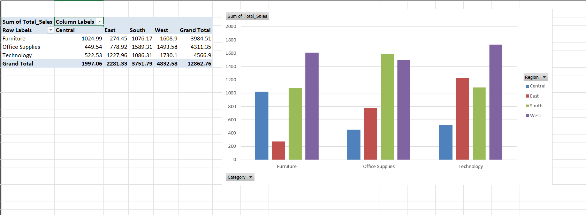

# Superstore Sales Analysis

Mini data‑analysis project using Python, SQLite & Excel.

## How to Run
1. `pip install pandas openpyxl xlsxwriter`
2. `python analysis.py`

## Key Insights
- Technology in West had the highest sales.
- Office Supplies top 5 orders highlighted.

